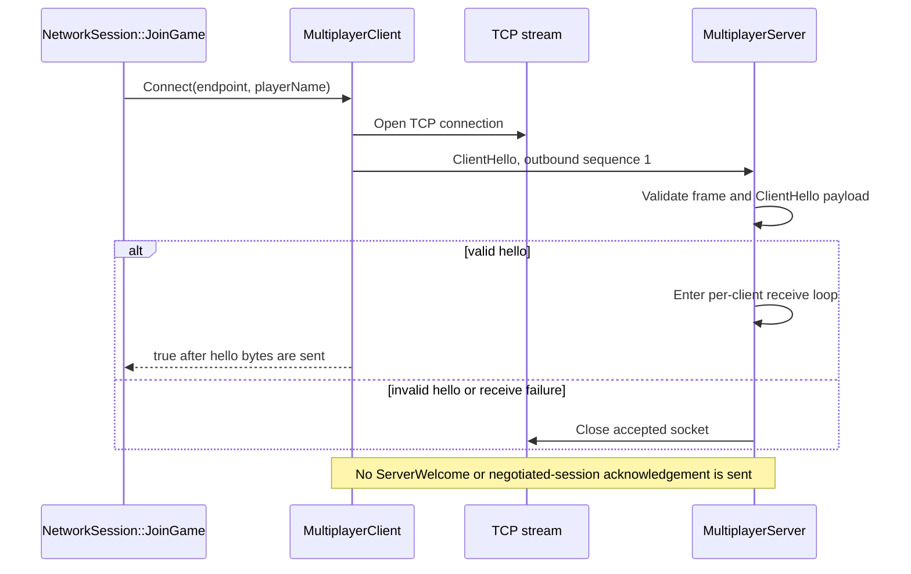
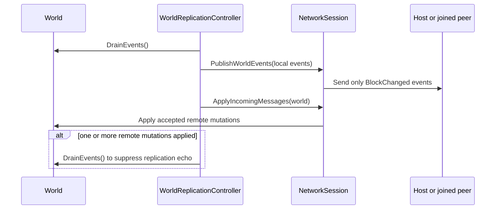

# Network Protocol and Replication

This document describes the protocol implemented under `src/network`. It is an
internal protocol boundary, not a public multiplayer contract. The voxel runtime
does not currently own a `WorldReplicationController`, and the installed public
SDK does not expose hosting or joining.

The source of truth is [NetworkProtocol.h](../src/network/NetworkProtocol.h) for
framing constants, [NetworkPayloadTypes.h](../src/network/NetworkPayloadTypes.h)
for payload fields, and [NetworkSession](../src/network/NetworkSession.h) plus
[WorldReplicationController](../src/network/WorldReplicationController.h) for
replication behavior.

## Current Transport and Connection Flow

`TcpSocket` is a move-only standalone-Asio adapter with a synchronous exact-span
API. The server owns one stop-aware asynchronous accept operation and one receive
thread per accepted client; the client owns one receive thread. Connected
sockets are non-blocking internally, so `SendBytes` and `ReceiveBytes` retry
partial transfers without trapping teardown inside a blocking OS call. Shutdown
signals those loops, workers join, and only then does the owner close the Asio
object. Socket errors are reported as `false` rather than exceptions or protocol
error objects. Framed protocol writes have an absolute 250 ms deadline per
recipient; cancellation, timeout, or a partial-write failure shuts down that
stream because its framing can no longer be reused safely.

`JoinGame` reports `Joined` after the TCP connection opens and the client sends
its hello. It does not wait for server acceptance. An empty player name can
therefore produce a short-lived local success even though the server rejects the
hello asynchronously.

## Packet Framing

Every message is one 20-byte header followed by exactly `payloadByteCount`
bytes. `ReceiveNetworkMessage` first reads exactly 20 bytes, validates the
header, allocates at most the bounded payload size, reads that exact payload,
and validates the complete packet.

| Offset | Wire field | C++ type | Validation |
| ---: | --- | --- | --- |
| 0 | `magic` | `std::uint32_t` | Must equal `ProtocolMagic`, `0x56454E54`. |
| 4 | `version` | `std::uint16_t` | Must equal `ProtocolVersion`, currently `2`. |
| 6 | `messageType` | `NetworkMessageType` (`std::uint16_t`) | Must be one of values 1 through 7 listed below. |
| 8 | `sequenceNumber` | `std::uint32_t` | Carried by framing; session pumps require a strictly increasing value for mutations. |
| 12 | `payloadByteCount` | `std::uint32_t` | Must not exceed `MaxPacketPayloadByteCount` (`65,536`). |
| 16 | `payloadChecksum` | `std::uint32_t` | Must match 32-bit FNV-1a over the payload only. |

The largest accepted framed packet is 65,556 bytes. `TryParsePacket` also
requires the supplied buffer to contain exactly one frame: missing or trailing
bytes cause rejection. Unknown message types and oversized payloads are rejected
by both `BuildPacket` and the header parser.

The codecs currently append the object representation of each scalar with
`AppendSerializedValue` and recover it with `memcpy`. There is no network-byte-
order conversion and no canonical floating-point encoding. Current Windows
peers therefore need matching integer endianness and floating-point
representation. Cross-endian and heterogeneous-float interoperability are not
protocol guarantees.

The FNV-1a checksum detects accidental payload corruption. It does not cover the
header, authenticate a sender, or protect against deliberate modification.

## Message Types and Payloads

| Value | Type | Implemented behavior |
| ---: | --- | --- |
| 1 | `ClientHello` | Required as the first client frame. The server validates it and then discards its contents. |
| 2 | `ServerWelcome` | Recognized by framing only; no payload codec, sender, or handler exists. |
| 3 | `PlayerSnapshot` | Codec and `MultiplayerClient::SendPlayerSnapshot` exist. `NetworkSession` currently ignores received snapshots. |
| 4 | `BlockMutation` | Implemented through client send, host validation/application, relay, and client application. |
| 5 | `Ping` | Recognized by framing only; no automatic response or session handler exists. |
| 6 | `Pong` | Recognized by framing only; no session handler exists. |
| 7 | `Disconnect` | Recognized by framing only; shutdown currently closes sockets without sending it. |

All implemented payload decoders require the exact field count and reject
trailing bytes.

### `ClientHelloPayload`

Wire order:

1. `std::uint16_t` player-name byte count.
2. That many unencoded string bytes.
3. `std::uint32_t` capability flags.

The serializer truncates names to `MaxPlayerNameByteCount` (`32`). The receiver
requires 1 through 32 bytes. It rejects unknown capability bits and also rejects
a zero supported-capability set. The defined bits are:

- `ProtocolCapabilityPlayerSnapshots` (`1 << 0`).
- `ProtocolCapabilityBlockMutations` (`1 << 1`).

`SerializeClientHello` masks unknown bits before transmission. The server does
not retain the player name, intersect capabilities, assign a player ID, or
acknowledge the accepted set.

### `PlayerSnapshotPayload`

Wire order is two `std::uint32_t` values followed by eight `float` values:

1. `playerId` and `simulationTickId`.
2. Position `x`, `y`, and `z`.
3. Velocity `x`, `y`, and `z`.
4. Yaw and pitch in degrees.

The payload is `2 * sizeof(std::uint32_t) + 8 * sizeof(float)` bytes (40 bytes
on the current Windows build). Serialization is covered, but there is no
server-side ownership check, tick-order check, relay, interpolation, or world
application. Advertising the player-snapshot capability does not activate any
of those behaviors.

### `BlockMutationPayload`

Wire order is:

1. `std::uint32_t mutationId`.
2. `std::uint32_t authorPlayerId`.
3. Three signed `std::int32_t` block coordinates: `x`, `y`, and `z`.
4. One `std::uint8_t blockId`.

The payload is 21 bytes. `TryReadBlockMutationMessage` rejects a block byte at
or beyond `BlockId::Count`. A valid payload becomes a single-block
`WorldBlockEdit`; air means a break and every other stored block means a place.
The world still rejects an out-of-height coordinate or a coordinate whose chunk
is not loaded.

`mutationId` and `authorPlayerId` are serialized but are not currently used for
deduplication, authorization, attribution, or conflict resolution. Locally
generated messages set both fields to zero.

## Version and Capability Handling

There is no version negotiation today. `TryParsePacketHeader` requires exact
equality with `ProtocolVersion` on every frame. A peer on another version is
treated like any other malformed stream, and there is no downgrade path or
version-rejection payload.

Capability flags are hello validation, not negotiated session state. A valid
hello must contain at least one known bit, but the server neither stores the
flags nor enforces them on later messages. Until a real `ServerWelcome`
exchange exists, compatible peers must be configured for the same protocol
version and must not infer that a capability was accepted merely because
`Connect` returned true.

A complete future negotiation would need a server response containing the
accepted version, accepted capability intersection, assigned connection/player
identity, and an explicit rejection reason. None of those fields exists in the
current wire contract.

## Sequence and Mutation Ordering

The client resets its outbound sequence counter to 1 for each connection. Its
hello consumes sequence 1; later client messages normally begin at 2. Each
server `ConnectedClient` has a separate outbound counter beginning at 1, and a
broadcast overwrites the source message's sequence with the destination
connection's next value.

`NetworkSequenceTracker` accepts only `sequenceNumber > lastAccepted`. It
rejects zero initially, duplicates, and stale values, while allowing gaps. The
host owns one tracker per client connection; a joined client owns one tracker
for the server stream. The hello is validated outside these trackers.

TCP already preserves stream order. The additional sequence rule makes
duplicate or stale mutation frames observable to the pump, but it does not
provide acknowledgements, retransmission, or conflict resolution. Unsigned
32-bit wraparound is not handled; a wrapped counter would no longer compare as
newer.

`WorldReplicationController::SynchronizeWorld` performs one frame in this
order:

Consequences of that order:

- Local events pending at the start of the frame are published before incoming
  mutations are applied.
- `BuildBlockMutationMessages` ignores every world event except
  `BlockChangedEvent`.
- A hosting session validates and applies a client mutation before calling
  `BroadcastExcept` with the origin connection excluded.
- The relay preserves the original payload but assigns a new per-destination
  packet sequence number.
- Applying a remote mutation generates a normal world event. The controller
  drains events after incoming application when at least one mutation was
  applied, preventing that mutation from being published back on the next
  frame.
- The suppression drain is not origin-tagged. It drains every event pending at
  that point, so future systems that can generate unrelated events concurrently
  will need explicit event provenance instead of this blanket drain.

The session flushes `_outboundWorldSnapshotMessages` before
`_outboundLiveMutationMessages`, but no code populates the snapshot queue.
`NetworkWorldSnapshotPolicy` has only `LiveMutationsOnly`. There is therefore no
initial world snapshot, chunk snapshot, revision barrier, or snapshot/live
ordering guarantee beyond live mutations.

## Pump Limits and Admission Limits

The current policy combines bounded counts with one per-frame write deadline;
it is not a bandwidth scheduler or queued-output budget:

- Host: at most 64 accepted block mutations per connection per call to
  `ApplyIncomingMessages`. Later messages from the same drained batch are
  rejected, not deferred.
- Joined client: at most 128 accepted server block mutations per pump. Later
  messages from that drained batch are rejected, not deferred.
- Default listening backlog: 8; values below 1 are clamped to 1 by
  `TcpSocket::Listen`.
- Default maximum open clients: 8; zero is converted to 1 by
  `MultiplayerServer::Start`.
- One framed write gets 250 ms per recipient. A broadcast can therefore spend
  up to roughly two seconds retiring eight non-reading peers before later
  output-queue work is considered.
- Default `simulationTickRateHz`: 20. Hosting rejects zero, but the value does
  not currently schedule pumps or validate snapshot ticks.

Rate-limit checks happen after message-type and payload validation but before
sequence acceptance. Rejected frames are removed from the incoming queue and
have no retry path.

## Error Handling

| Failure | Current result |
| --- | --- |
| DNS resolution, connect, bind, listen, accept, exact read, or exact write fails | The socket operation returns `false` or `std::nullopt`. |
| Header has wrong magic/version/type/size | Packet parsing returns empty. The owning receive loop stops; the server closes that peer socket. |
| Payload is truncated, has trailing bytes, or fails FNV-1a | Packet parsing returns empty and the receive loop stops. There is no stream resynchronization. |
| First server-side message is not a valid `ClientHello` | The server closes the accepted socket without a protocol rejection message. |
| Connection exceeds `maxConnectedClients` | The newly accepted socket is closed without a protocol rejection message. |
| Known but unsupported session message arrives | `NetworkSession` increments `messagesIgnored`; it does not close the connection. |
| Block payload or block ID is invalid | The pump increments `invalidMessagesRejected`. |
| Mutation is stale/duplicate or exceeds the per-pump count | The pump increments `messagesRejectedBySequence` or `messagesRejectedByRateLimit`. |
| Valid mutation targets invalid world coordinates/storage | World application returns false and the pump increments `invalidMessagesRejected`. |
| Client or host framed write fails or exceeds 250 ms | The stream is shut down and cannot carry another frame. A failed host recipient is omitted from the successful-write count. |
| Host settings use a zero tick rate | `HostGame` reports `InvalidHostTickRate` and emits `HostStartFailed`. |
| Listen or join setup fails | `HostStartFailed` or `JoinFailed` is exposed through `LastError` and session events. |

An asynchronous client disconnect sets `MultiplayerClient::IsConnected` to
false, but `NetworkSession::Mode` remains `Joined` until `Stop` is called and no
session disconnect event is synthesized. Reads have no idle timeout, keepalive,
cancellation message, or idle-peer policy.

## Security and Integration Boundaries

- `NetworkAuthMode` currently has only `NoAuthentication`.
- TCP traffic is neither encrypted nor authenticated.
- The checksum is not a message authentication code.
- Player IDs and mutation authors are trusted wire values but are not used by
  the session, so they do not establish identity or authority.
- The session has no durable persistence, rollback, acknowledgement, or
  reconnect/resume protocol.
- `ve_network` is intentionally outside the `ve_runtime` and
  `ve_voxel_sandbox` target closures. Networking is not exercised by the voxel
  demo's runtime smokes.

## Verified Coverage and Remaining Gaps

Current automated coverage verifies exact TCP span transfer over loopback,
stop-aware accept and stream shutdown, client/server worker quiescence,
bounded writes to a non-reading peer, connection churn, packet
length/type/checksum rejection, sequence acceptance, bounded hello fields,
payload roundtrips, block-edit application, and session error events.
The relevant tests are the
[network framing tests](../Tests/NetworkPacketFramingTests_NetworkPacketParserRejectsTruncatedAndCorruptedPacketsTests.cpp),
[serialization tests](../Tests/NetworkSerializationTests_NetworkPlayerSnapshotSerializationUsesExplicitWireFieldsTests.cpp),
and [Asio/session tests](../Tests/NetworkAsioSocketTests_AsioTcpAdapterTransfersAnExactByteSpanOverLoopbackTests.cpp).

Before multiplayer can become a public runtime feature, the implementation
still needs:

1. A real `ServerWelcome` acceptance/rejection exchange and stored negotiated
   capabilities.
2. Stable player identity plus authentication/authorization policy.
3. Player-snapshot validation, server relay/authority, tick ordering, and
   interpolation.
4. An initial world/chunk snapshot schema with revisions and an explicit
   snapshot-to-live-mutation barrier.
5. Mutation IDs/author semantics, conflict rules, acknowledgements, and sequence
   wraparound handling.
6. Canonical byte order and floating-point encoding if heterogeneous peers are
   supported.
7. Disconnect reasons, read-idle timeouts/keepalive, queued asynchronous output
   with a global backpressure budget, and session events for asynchronous loss.
8. Runtime/public-SDK integration and multi-client end-to-end tests covering
   handshake, relay, rejection, reconnect, and snapshot catch-up.
